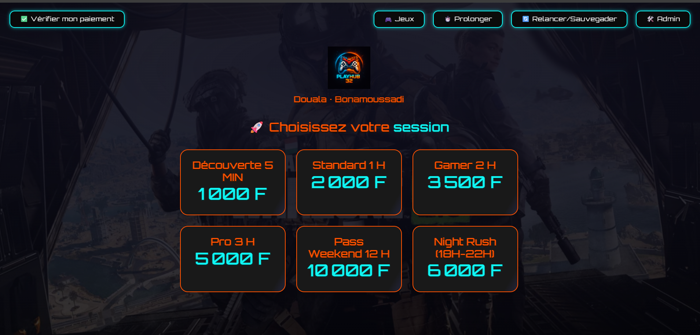
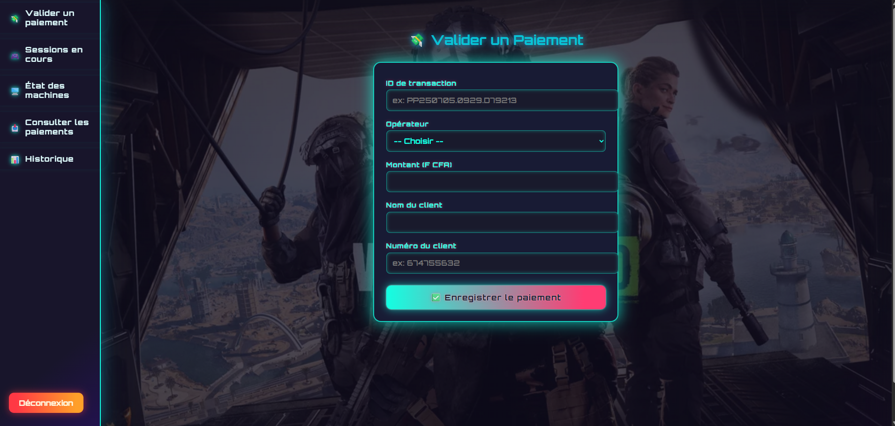

# 🎮 PlayHub32: Automated Gaming Arena Management System

**PlayHub32** is a modern, end-to-end platform for fully automating gaming arena operations.  
It connects real-time player management, mobile payments, flexible sessions, and a powerful admin dashboard—all in one sleek web system.

---

## ✨ Main Features

- **Mobile payment validation (Orange Money / MTN Money)**
- **Client self-service: start, extend, save or resume game sessions**
- **Live admin dashboard: station monitoring, fraud protection, transaction logs**
- **Professional receipts with QR codes, ready for thermal printer**
- **Modern responsive UI: FastAPI, Tailwind CSS, Alpine.js**
- **Notifications, session timers, and anti-fraud logic**

---

## 🕹️ Client Side Experience

### 1. Start a Session
- Player pays via Orange or MTN Money, gets a transaction ID.
- On a kiosk/PC, enters their transaction ID, selects a package (1h, 2h, etc.) and chooses a free station.
- After admin validation, they receive a **session code** and the station is unlocked for immediate play.

### 2. Extend a Session
- At any time, players can **extend their session** with another payment and transaction ID.
- An interactive summary and countdown confirm their new playtime.

### 3. Pause & Resume
- Players can **pause** (save) and later **resume** their session on any available station (optional feature).

### 4. Instant Receipt Printing
- Upon confirmation, a **custom receipt** is printed with:
  - Session reference, station, time, amount paid, payment ID, date/time, and a **QR code** for verification.

### 5. User-Friendly and Secure
- Real-time feedback if the payment is insufficient or the transaction ID is invalid.
- Attempts at fraud (reused ID, double payment, etc.) are automatically blocked.

---

## 🛠️ Technology Stack

- **Backend**: Python (FastAPI, SQLAlchemy, PostgreSQL)
- **Frontend**: HTML5, Tailwind CSS, Alpine.js
- **Payments**: Orange Money / MTN Money (manual or semi-automated admin validation)
- **Printing**: Thermal printer integration (ESC/POS, styled receipts with QR codes)

---

## 🛡️ Admin Features

### 1. Payment Validation & Control
- Admin checks and validates payments, entering transaction details (amount, phone number, etc.).
- Validated payments can be used by players for session creation or extension.

### 2. Real-time Dashboard
- **Live monitoring** of every gaming station: occupied, free, paused, etc.
- List of **active sessions** with real-time countdowns.
- Access to **session history**, export tools, and usage stats.

### 3. Logs & Anti-Fraud
- **All transactions and session actions are logged** (usage, fraud attempts, etc.).
- Complete searchable history by station or user.

### 4. Dynamic Session Management
- Admin can pause, resume, or end sessions manually.
- Control over durations, payment verification, and session offers.

---

## 📋 Installation & Setup

1. **Clone the repository**
   ```bash
   git clone https://github.com/youruser/PlayHub32.git
